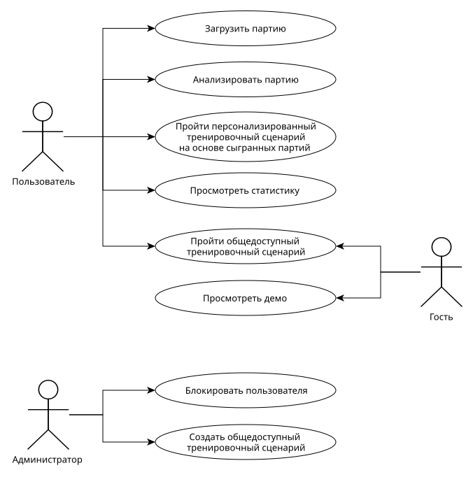
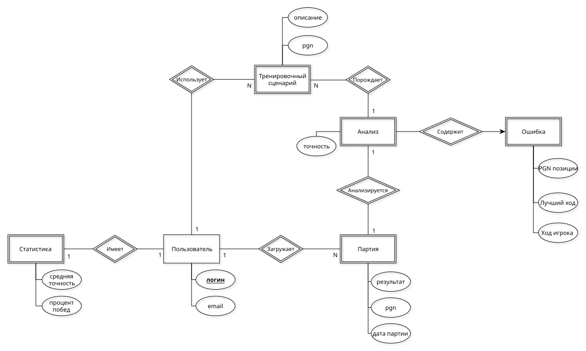
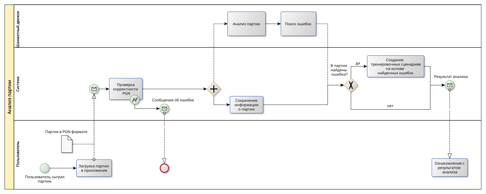

# ППО

## 1. Название проекта
`ChessInsight`

## 2. Описание идеи проекта
`ChessInsight` - это приложение для шахматистов,
которое позволяет анализировать сыгранные партии,
получать детальную статистику по своим играм
и улучшать навыки за счет интерактивного исправления ошибок.
Приложение использует компьютерный анализ для оценки ходов и предоставляет
пользователю рекомендации по улучшению стратегии.
ChessInsight также включает режим тренировки,
где можно отрабатывать слабые места на основе анализа предыдущих партий.

## 3. Предметная область
Предметная область проекта связана с шахматами и анализом игровых данных.
Приложение работает с шахматными партиями в формате `PGN` (_Portable Game Notation_),
использует "шахматные движки" для анализа (пользователю предоставляется выбор между `open-source` моделями, такими, как `Stockfish`, `Leela`).
В рамках анализа игровых данных приложение предоставляет пользователю наглядную визуализацию статистики на основе ранее сыгранных партий,
включая ошибки, точность ходов и ключевые моменты партий. Основная цель проекта - помочь шахматистам любого уровня отточить свои навыки игры
в интерактивном формате.

## 4. Анализ аналогичных решений

| Критерий                                                           | Chess.com                      | Lichess      | ChessBase               |
| ------------------------------------------------------------------ | ------------------------------ | ------------ | ----------------------- |
| Возможность анализа партий                                         | Ограничена в бесплатной версии | Неограничена | Только в платной версии |
| Возможность получения статистики по всем сыгранным играм за период | Только в платной версии        | -            | -                       |
| Наличие режима интерактивного исправления ошибок             | -                              | -            | -                       |
| Доступность в РФ                                                   | -                              | +            | -                       |
## 5. Обоснование целесообразности и актуальности проекта
Проект актуален, так как объединяет в себе функционал анализа партий, обучения и получения статистики в одном приложении, что упрощает процесс улучшения навыков для шахматистов. Существующие решения являются платными, либо имеют ограниченный функционал в бесплатных версиях. Схема "тренировок", предлагаемая `ChessInsight`, основывающаяся на исправлении ошибок, допущенных в сыгранных ранее партиях, является уникальной  особенностью приложения, выделяющей его на фоне конкурентов.

## 6. Описание акторов (ролей)
- __Пользователь__ - основной актор, который загружает партии, анализирует их, просматривает статистику и использует интерактивный тренажер.
- __Гость__ - может просматривать демонстрационные примеры и базовые функции без регистрации.
- __Администратор__ - может блокировать пользователей и создавать специальные тренировочные сценарии (например, на основе партий профессиональных шахматистов), доступные всем пользователям. 
## 7. Use-Case диаграмма

## 8. ER-диаграмма сущностей

## 9.  Пользовательские сценарии
#### Сценарий 1: Пользователь анализирует партию

1. Пользователь загружает PGN-файл с шахматной партией.
2. Приложение обрабатывает файл и отображает партию на доске.
3. Пользователь выбирает опцию "Анализ".
4. Приложение запускает движок для анализа.
5. Пользователь просматривает ошибки и рекомендации.

#### Сценарий 2: Пользователь использует тренажер

1. Пользователь выбирает "Тренировка" в меню.
2. Приложение предлагает позиции на основе прошлых ошибок.
3. Пользователь решает задачи, получая обратную связь.

#### Сценарий 3: Администратор создает тренировочный сценарий

1. Администратор заходит в панель управления.
2. Выбирает опцию "Создать тренировочный сценарий".
3. Загружает PGN-файл с партией.
4. Система создает сценарий и делает его доступным для всех пользователей.

#### Сценарий 4: Гость просматривает демо

1. Гость заходит на главную страницу.
2. Выбирает опцию "примеры".
3. Просматривает пример анализа партии.
4. Решает задачу основанную на партии из примера в демо-режиме тренажера.

#### Сценарий 5: Администратор блокирует пользователя

1. Администратор заходит в панель управления.
2. Выбирает "Список пользователей".
3. Находит пользователя, нарушившего правила.
4. Блокирует его аккаунт.

# 10.  Формализация ключевых бизнес-процессов

