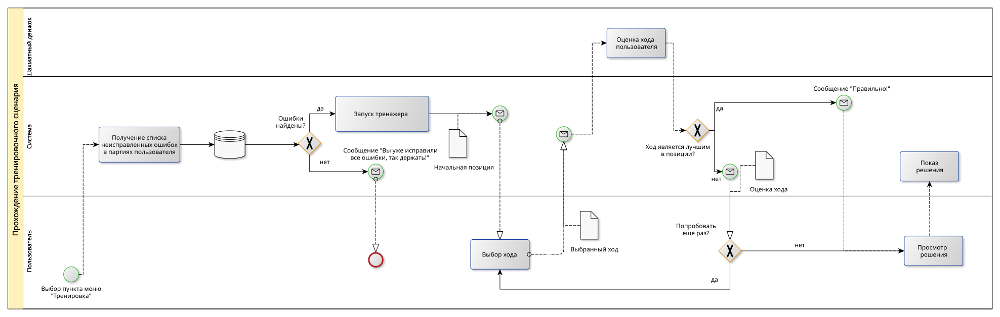

# ППО

## 1. Название проекта
`ChessInsight`

## 2. Описание идеи проекта
`ChessInsight` - это приложение для шахматистов,
которое позволяет анализировать сыгранные партии,
получать детальную статистику по своим играм
и улучшать навыки за счет интерактивного исправления ошибок.
Приложение использует компьютерный анализ для оценки ходов и предоставляет
пользователю рекомендации по улучшению стратегии.
ChessInsight также включает режим тренировки,
где можно отрабатывать слабые места на основе анализа предыдущих партий.

## 3. Предметная область
Предметная область проекта связана с шахматами и анализом игровых данных.
Приложение работает с шахматными партиями в формате `PGN` (_Portable Game Notation_),
использует "шахматные движки" для анализа (пользователю предоставляется выбор между `open-source` моделями, такими, как `Stockfish`, `Leela`).
В рамках анализа игровых данных приложение предоставляет пользователю наглядную визуализацию статистики на основе ранее сыгранных партий,
включая ошибки, точность ходов и ключевые моменты партий. Основная цель проекта - помочь шахматистам любого уровня отточить свои навыки игры
в интерактивном формате.

## 4. Анализ аналогичных решений

| Критерий                                                           | Chess.com                      | Lichess      | ChessBase               |
| ------------------------------------------------------------------ | ------------------------------ | ------------ | ----------------------- |
| Возможность анализа партий                                         | Ограничена в бесплатной версии | Неограничена | Только в платной версии |
| Возможность получения статистики по всем сыгранным играм за период | Только в платной версии        | -            | -                       |
| Наличие режима<br>интерактивного<br>исправления ошибок             | -                              | -            | -                       |
| Доступность в РФ                                                   | -                              | +            | -                       |
## 5. Обоснование целесообразности и актуальности проекта
Проект актуален, так как объединяет в себе функционал анализа партий, обучения и получения статистики в одном приложении, что упрощает процесс улучшения навыков для шахматистов. Существующие решения являются платными, либо имеют ограниченный функционал в бесплатных версиях. Схема "тренировок", предлагаемая `ChessInsight`, основывающаяся на исправлении ошибок, допущенных в сыгранных ранее партиях, является уникальной  особенностью приложения, выделяющей его на фоне конкурентов.

## 6. Описание акторов (ролей)
- __Пользователь__ - основной актор, который загружает партии, анализирует их, просматривает статистику и использует интерактивный тренажер.
- __Гость__ - может просматривать демонстрационные примеры и базовые функции без регистрации.
- __Администратор__ - может блокировать пользователей и создавать специальные тренировочные сценарии (например, на основе партий профессиональных шахматистов), доступные всем пользователям.
## 7. Use-Case диаграмма


## 8. ER-диаграмма сущностей


## 9.  Пользовательские сценарии
#### Сценарий 1: Пользователь анализирует партию

1. Пользователь загружает PGN-файл с шахматной партией.
2. Приложение обрабатывает файл и отображает партию на доске.
3. Пользователь выбирает опцию "Анализ".
4. Приложение запускает движок для анализа.
5. Пользователь просматривает ошибки и рекомендации.

#### Сценарий 2: Пользователь использует тренажер

1. Пользователь выбирает "Тренировка" в меню.
2. Приложение предлагает позиции на основе прошлых ошибок.
3. Пользователь решает задачи, получая обратную связь.

#### Сценарий 3: Администратор создает тренировочный сценарий

1. Администратор заходит в панель управления.
2. Выбирает опцию "Создать тренировочный сценарий".
3. Загружает PGN-файл с партией.
4. Система создает сценарий и делает его доступным для всех пользователей.

#### Сценарий 4: Гость просматривает демо

1. Гость заходит на главную страницу.
2. Выбирает опцию "примеры".
3. Просматривает пример анализа партии.
4. Решает задачу основанную на партии из примера в демо-режиме тренажера.

#### Сценарий 5: Администратор блокирует пользователя

1. Администратор заходит в панель управления.
2. Выбирает "Список пользователей".
3. Находит пользователя, нарушившего правила.
4. Блокирует его аккаунт.

# 10.  Формализация ключевых бизнес-процессов




# 11. Запуск тестов и отчет

```bash
mvn -pl core,jpa -am test
```

```bash
mvn -pl core,jpa -am allure:report
```

Отчеты Allure:

`core/target/site/allure-maven-plugin`

`jpa/target/site/allure-maven-plugin`

Случайный порядок выполнения тестов включен:

- `maven-surefire-plugin` и `maven-failsafe-plugin` настроены с `runOrder=random`;
- JUnit 5 настроен на random-order классов и методов через `junit-platform.properties`.

Для воспроизводимости конкретного случайного прогона используется `seed`:

```bash
TEST_RANDOM_SEED=123456 ./ci/run-stage.sh unit
```

Тот же `seed` передается в Maven (`tests.random.seed`, `junit.jupiter.execution.order.random.seed`).

Наблюдаемые дефолты (по `mvn -X`):

- `forkCount` = `1`;
- `reuseForks` = `true`.

Это означает:

- один forked JVM-процесс на модуль и фазу (`test` / `integration-test`);
- не отдельный процесс на каждый тест-класс и не отдельный процесс на каждый тест-метод.

```bash
mvn -pl core -Dtest=ru.chessinsight.domain.common.pagination.PageTest -X test | rg -n "forkCount|reuseForks|Forking"
```
```bash
mvn -pl jpa -DskipITs=true -DskipUnitTests=true -X verify | rg -n "maven-failsafe-plugin|forkCount|reuseForks"
```

# 12. Локальный запуск integration/e2e на одном инстансе PostgreSQL

Для CI/CD сохранен режим Testcontainers по умолчанию.
Для локального запуска добавлен контейнерный режим `local-shared`:
тесты выполняются внутри `test-runner` контейнера, а PostgreSQL поднимается отдельным контейнером.
Каждый прогон использует отдельную временную схему в одном и том же инстансе БД, поэтому несколько прогонов можно выполнять параллельно.

Поднять PostgreSQL для локальных прогонов:

```bash
./ci/start-local-postgres.sh
```

Скрипт создаст сеть `chessinsight-itest-net`, контейнер `chessinsight-it-postgres` и выведет JDBC-адреса.

Пример запуска integration:

```bash
./ci/test-on-local-instance.sh integration
```

Пример запуска e2e:

```bash
./ci/test-on-local-instance.sh e2e
```

По умолчанию используется адрес контейнера в сети Docker:
`jdbc:postgresql://pg-itest:5432/chessinsight_test`.

После каждого запуска (успешного или аварийного) скрипт принудительно удаляет тестовую схему из PostgreSQL.

# 13. Интеграция со внешним Stockfish (mock/real)

Контракт интеграции (UCI по TCP), mock-сервер и E2E-сценарий описаны в:

`docs/stockfish-integration.md`

Переключение внешнего сервиса выполняется конфигурацией:

- runtime backend: `ENGINE_STOCKFISH_HOST`, `ENGINE_STOCKFISH_PORT`
- E2E pipeline: `TEST_STOCKFISH_PROVIDER=mock|real`

Примеры E2E запуска:

```bash
TEST_STOCKFISH_PROVIDER=mock ./ci/run-stage.sh e2e
```

```bash
TEST_STOCKFISH_PROVIDER=real ./ci/run-stage.sh e2e
```

Локальный запуск docker-compose окружения для демонстрации:

```bash
./ci/run-demo-env.sh mock
```

```bash
./ci/run-demo-env.sh real
```

# 14. Нагрузочное тестирование анализа партий (mock Stockfish)

Полный контур нагрузочного тестирования (деградация, рабочая нагрузка, восстановление после перегруза) описан в:

`docs/analysis-load-testing.md`

Быстрый запуск:

```bash
STEADY_TRIALS=1 STEADY_REQUESTS=20 RECOVERY_TRIALS=1 ./ci/run-analysis-perf.sh
```

Полный запуск (по умолчанию `STEADY_TRIALS=100`):

```bash
./ci/run-analysis-perf.sh
```
