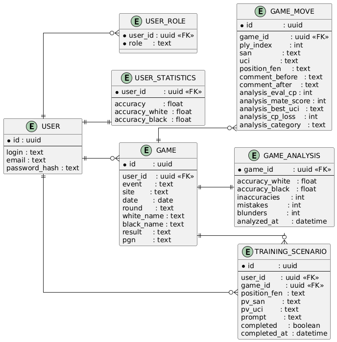
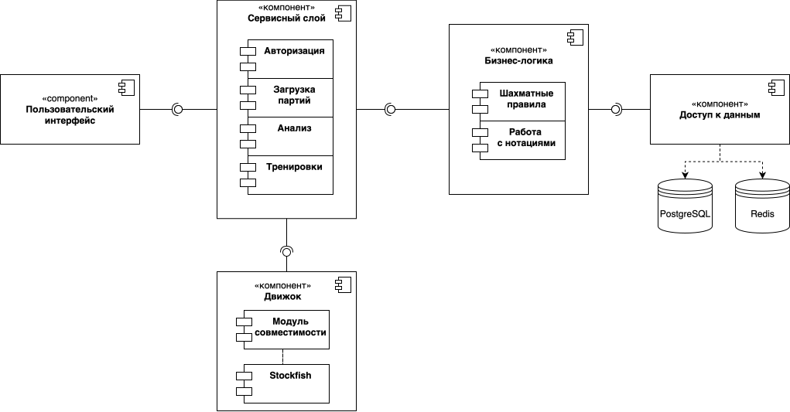
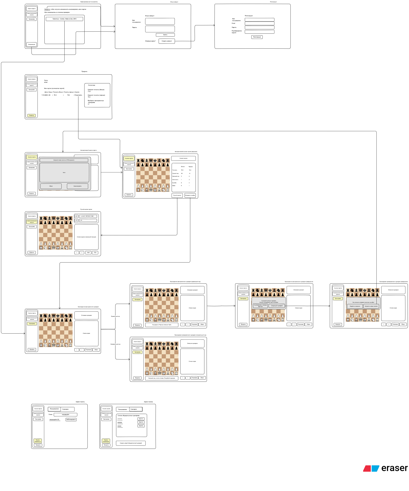

# ChessInsight

## Цель и ценность
Цель проекта -- помочь шахматистам более эффективно анализировать свои партии, выявлять ошибки и
тренироваться на основе собственных слабых мест. Решается проблема разрозненности
и ограниченной доступности инструментов: загрузка PGN -> компьютерный анализ -> метрики точности ->
автогенерация тренировок по ошибкам — в одном приложении.

## Краткие функциональные требования
- загрузка PGN партии и просмотр на доске;
- локальный/браузерный анализ ходов (Stockfish)
с метриками: точность, тип ошибки (inaccuracy/mistake/blunder);
- хранение информации о партиях пользователя и результате их анализа;
- подсчет статистики пользователя: точность за белых/черных, количество пройденных тренировочных сценариев;
- генерация тренировочных сценариев на основе проведенного анализа;
- аутентификация (JWT), роли Пользователь/Гость/Администратор;
- модерация и публикация общих тренировочных сценариев (для администраторов);
- индексирование ходов и позиций (Elasticsearch) для быстрых запросов;
- кеширование регулярно используемых данных и хранение refresh-токенов (Redis).

## Use‑case диаграмма

## BPMN: основные бизнес‑процессы

### 1) Анализ загруженной партии

### 2) Тренировка по найденным ошибкам

## Пользовательские сценарии (примеры)
#### Сценарий 1: Пользователь анализирует партию

1. Пользователь загружает PGN-файл с шахматной партией.
2. Приложение обрабатывает файл и отображает партию на доске.
3. Пользователь выбирает опцию "Анализ".
4. Приложение запускает движок для анализа.
5. Пользователь просматривает ошибки и рекомендации.

#### Сценарий 2: Пользователь использует тренажер

1. Пользователь выбирает "Тренировка" в меню.
2. Приложение предлагает позиции на основе прошлых ошибок.
3. Пользователь решает задачи, получая обратную связь.

#### Сценарий 3: Администратор создает тренировочный сценарий

1. Администратор заходит в панель управления.
2. Выбирает опцию "Создать тренировочный сценарий".
3. Загружает PGN-файл с партией.
4. Система создает сценарий и делает его доступным для всех пользователей.

#### Сценарий 4: Гость просматривает демо

1. Гость заходит на главную страницу.
2. Выбирает опцию "примеры".
3. Просматривает пример анализа партии.
4. Решает задачу основанную на партии из примера в демо-режиме тренажера.

#### Сценарий 5: Администратор блокирует пользователя

1. Администратор заходит в панель управления.
2. Выбирает "Список пользователей".
3. Находит пользователя, нарушившего правила.
4. Блокирует его аккаунт.

## ER‑диаграмма сущностей

## Технологический стек
- **Backend**: Java 24 + Spring Boot 3
- **Хранилища**: PostgreSQL, Redis (refresh‑токены/кеш), Elasticsearch (поиск по ходам/позициям).
- **Frontend**: TypeScript + React/Redux
- **Доставка**: Docker + docker‑compose; CI/CD (GitHub Actions)
- **Аналитика**: Stockfish (локально в браузере через WASM и на сервере для верификации).

## Диаграмма БД

## Компонентная диаграмма

## Черновые эскизы экранов

